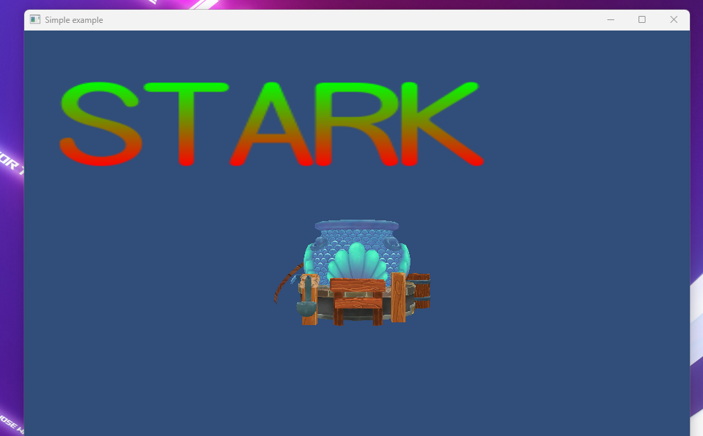
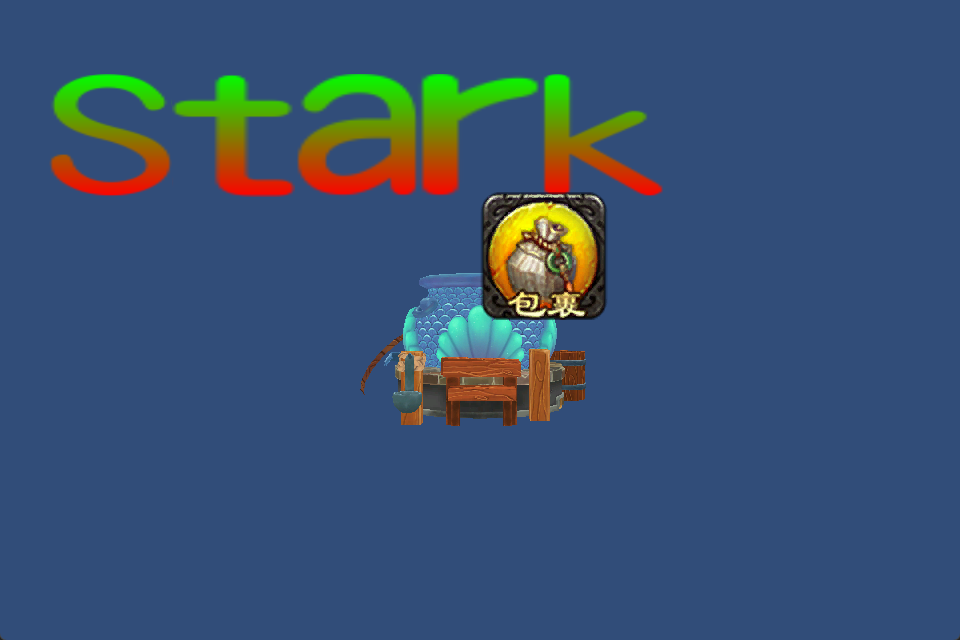
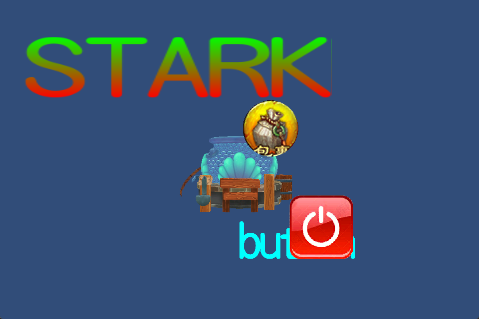

# NIU-Game-Engine
 
## Preparation for the desgin
***
#### Date: 1/15/2023 - 2/1/2023
##### Do some research about the GameEngine
1. [x] [Computer Graphic](https://www.youtube.com/watch?v=W6yEALqsD7k&list=PL9_jI1bdZmz2emSh0UQ5iOdT2xRHFHL7E)
2. [x] [Pipeline of the Graphic](https://www.bilibili.com/video/BV1oU4y1R7Km/?spm_id_from=333.337.search-card.all.click)
3. [x] [Choose the meture Engine to learn](https://unity.com/)
  Some Recommanded free Chinese book and course 
 You can find each of them on bilibili for free 
 [GAMES101]
 [GAMES104]
 [GAMES105]
 [GAMES206]
 [游戏引擎 浅入浅出]
 [Unity Document]
## Create the Engine
***
#### Date: 2/1/2023 - 2/20/2023
##### Finish the render modules

1. [x] [Camera](https://github.com/zhengtianl/NIU/blob/d85946b7a35cf46c8a5af719b957b40ae24358fa/source/renderer/camera.cpp)
2. [x] [Material](https://github.com/zhengtianl/NIU/blob/d85946b7a35cf46c8a5af719b957b40ae24358fa/source/renderer/material.cpp)
3. [x] [Mesh](https://github.com/zhengtianl/NIU/blob/d85946b7a35cf46c8a5af719b957b40ae24358fa/source/renderer/mesh_filter.cpp)
4. [x] [Shader](https://github.com/zhengtianl/NIU/blob/d85946b7a35cf46c8a5af719b957b40ae24358fa/source/renderer/shader.cpp)
5. [x] [texture](https://github.com/zhengtianl/NIU/blob/d85946b7a35cf46c8a5af719b957b40ae24358fa/source/renderer/texture2d.cpp)

#### Date: 2/21/2023 - 2/23/2023
1. [x] [Input Logic](https://github.com/zhengtianl/NIU/blob/d85946b7a35cf46c8a5af719b957b40ae24358fa/source/control)

#### Date: 2/21/2023 - 2/25/2023
1. [x] [Create the test and change the structure of the engine](https://github.com/zhengtianl/NIU/blob/c654d47df9ffc7d8f6d1778347c43c040aed6110/example)

#### Date: 2/25/2023 - 2/27/2023
1. [x] import the font depencies
2. [x] render the font on the screen (picture showed on the below)
   

#### Date: 3/3/2023 Section:GUI
1. [x] Orthogonal camera matrix implementation
   

#### Date: 3/7/2023 Section:GUI（button）
1. [x] [finished the button create](https://github.com/zhengtianl/NIU/blob/9a37984d6f1e89435ec8de32b15ab01d796194a2/source/ui)
   
   
